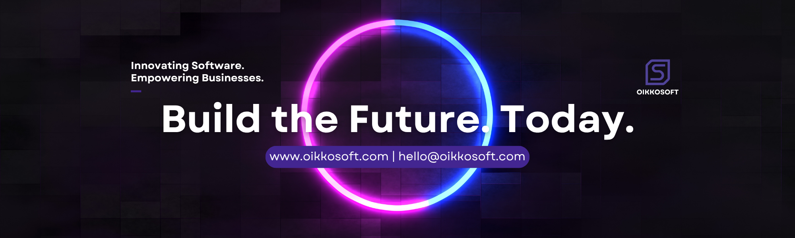

# Welcome to OikkoSoft

### Building innovative solutions for the modern world

*We create powerful, scalable software that drives business growth and digital transformation.*

---

## Why Choose OikkoSoft?

We combine technical expertise with business acumen to deliver solutions that drive real results.

### Custom Development
Tailored software solutions built to meet your unique business requirements and scale with your growth.

### Fast Delivery
Agile methodology ensures rapid development cycles and quick time-to-market for your products.
- **Average Project Delivery:** 2-4 weeks

### Secure & Reliable
Enterprise-grade security and robust infrastructure to protect your data and ensure uptime.

### Innovation First
Cutting-edge technologies and innovative approaches to solve complex business challenges.

---

## Our Services

Comprehensive software solutions to power your digital transformation journey.

### Web Development
Modern, responsive web applications built with the latest technologies like Next.js, React, and Node.js.

- ✓ Progressive Web Apps
- ✓ E-commerce Platforms
- ✓ Enterprise Portals

### Mobile Development
Native and cross-platform mobile applications that deliver seamless user experiences on iOS and Android.

- ✓ iOS & Android Apps
- ✓ React Native
- ✓ Flutter Development

### Cloud Solutions
Scalable cloud infrastructure and migration services to optimize your operations and reduce costs.

- ✓ AWS & Azure
- ✓ Cloud Migration
- ✓ DevOps & CI/CD

### Data & AI
Harness the power of data analytics and artificial intelligence to gain insights and automate processes.

- ✓ Machine Learning
- ✓ Data Analytics
- ✓ AI Integration

---

## Our Development Process

A proven methodology that ensures successful project delivery from concept to launch.

### 1️⃣ Discovery & Planning
We start by understanding your business goals, target audience, and project requirements to create a comprehensive strategy.

### 2️⃣ Design & Development
Our team crafts intuitive designs and builds robust solutions using cutting-edge technologies and best practices.

### 3️⃣ Testing & Quality Assurance
Rigorous testing ensures your product is bug-free, secure, and performs optimally across all platforms.

### 4️⃣ Launch & Support
We deploy your solution and provide ongoing maintenance and support to ensure continued success.

---

## Featured Projects

### E-Commerce Platform
A modern e-commerce solution with real-time inventory management and seamless payment integration.

**Tech Stack:** Next.js • TypeScript • Stripe

### Healthcare Mobile App
HIPAA-compliant telehealth application connecting patients with healthcare providers instantly.

**Tech Stack:** React Native • Node.js • AWS

### Analytics Dashboard
Real-time business intelligence platform with predictive analytics and custom reporting.

**Tech Stack:** Python • TensorFlow • React

### Cloud Infrastructure
Scalable microservices architecture with automated deployment and monitoring.

**Tech Stack:** AWS • Docker • Kubernetes

---

## Client Testimonials

> *"OikkoSoft delivered an exceptional web application that exceeded our expectations. Their team's expertise and dedication transformed our business operations."*  
> **— Sarah Johnson**, CEO, TechVenture Inc

> *"Working with OikkoSoft was a game-changer. They delivered a scalable cloud solution that improved our efficiency by 60% within the first quarter."*  
> **— Michael Chen**, CTO, DataFlow Systems

> *"The mobile app they developed is phenomenal. User engagement increased by 85% and our customers love the seamless experience across all devices."*  
> **— Emily Rodriguez**, Product Manager, InnovateCo

---

## Technologies We Work With

### Frontend

### Backend

### Cloud & DevOps

### Database

---

## Get In Touch

### Let's Build Something Amazing Together!

Whether you have a specific project in mind or just want to explore possibilities, we're here to help.  
Our team is ready to turn your ideas into reality.

### Contact Information

- **Location:** Sirajganj, Bangladesh
- **Email:** [oikkosoft@gmail.com](mailto:oikkosoft@gmail.com)
- **Phone:** +8801628179612 | +8801780365440
- **Website:** [www.oikkosoft.tech](https://www.oikkosoft.tech)

### Business Hours

- **Monday - Saturday:** 10:00 AM - 10:00 PM
- **Sunday:** Closed

---

## Quick Links

- [Home](https://www.oikkosoft.tech/)
- [About Us](https://www.oikkosoft.tech/about)
- [Services](https://www.oikkosoft.tech/services)
- [Projects](https://www.oikkosoft.tech/projects)
- [Contact](https://www.oikkosoft.tech/contact)

---

## Connect With Us

---

### Ready to Transform Your Business?

**Let's discuss how we can help you achieve your goals with innovative software solutions.**

---

**© 2025 OikkoSoft. All rights reserved.**

*Trusted by innovative companies worldwide*

**Fast Response • Expert Team • Proven Results**

